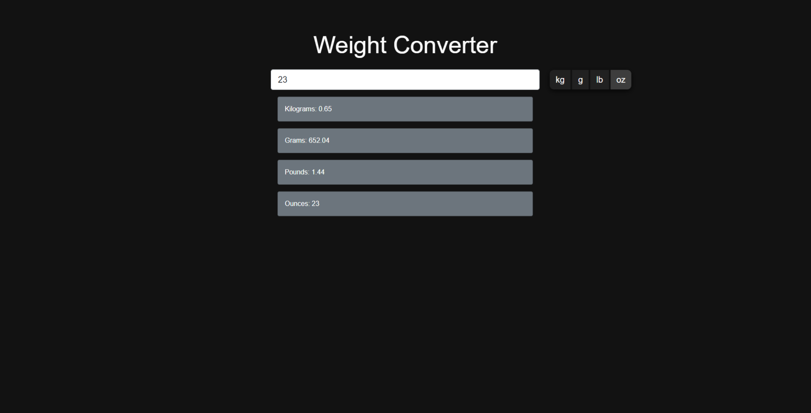

# WeightConverter

---

### Table of Contents

- [Description](#description)
- [How To Use](#how-to-use)
- [Author Info](#author-info)

---

## Description

Weight Converter is a simple application where users can convert between the common units of weight.

#### Technologies

- HTML
- CSS Bootstrap Framework
- Vanilla Javascript

---

## How To Use

This project is extremely simple to use.

- Type a number in the textbox
- Select one of the units of weight
- The calculated results will be displayed below instantaneously

---

## Author Info

- LinkedIn - [@StephenPalazzo](https://www.linkedin.com/in/stephenpalazzo)
- Website - [Stephen Palazzo](https://stephenpalazzo.com)

[Back To The Top](#WeightConverter)
